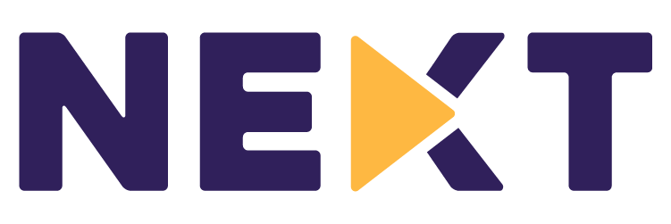
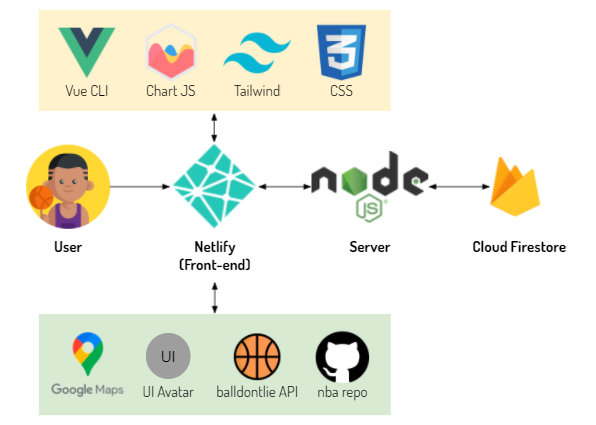

# Table of Contents
1. [ Project Overview ](#overview)
2. [ How to Install and Run Our Web Application (for Developers) ](#installation)
3. [ How to Deploy Our Web Application (for Developers) ](#deployment)
4. [ How to Use Our Web Application ](#visitors)
5. [ Figma ](#figma)
6. [ The Team ](#team)

# 🏀 IS216 - Group 38 - NEXT

# 🏀 The Team ##
* Chew Yi Xin (yixin.chew.2020@scis.smu.edu.sg)
* Gan Jian Lin (jianlin.gan.2020@scis.smu.edu.sg)
* Joel Lim (joel.lim.2020@scis.smu.edu.sg)
* Loh Kok Wee (kokwee.loh.2020@scis.smu.edu.sg)

# 🏀 Project Overview #
As there are a limited number of basketball courts, players will need to either share the courts or join a pickup game. However, there are currently no reliable avenues to facilitate this. As a result, it is a common sight to see players heading down to multiple basketball courts to check the availability of games and courts. Our project, Next, aims to organise this fragmented network of basketball games in Singapore to help users better visualise the availability of courts/games and reduce wasted time.

# 🏀 How to Install and Run Our Web Application (for Developers) ##
In order to

# 🏀 How to Deploy Our Web Application (for Developers) ##
* As an optional X-factor, did your group deploy your web application to cloud? (e.g. AWS, GCP, Azure, Heroku, Digital Ocean, or similar) If so, provide a step-by-step description of how a developer can deploy your web application
* Feel free to use diagrams and images to describe.

# 🏀 How to Use Our Web Application (for Visitors to our Website) ##
* Yay! Your website is READY for visitors!
* Provide a step-by-step description of what the user/visitor can/should do upon visiting your website for the first time.
* It would be wonderful if you could include **screenshot images** of web pages to demonsrate what the user/visitor can/should do.

# 🏀 Figma ##
<!-- * FEEL FREE to **add more things** into this **README** -->
* [Figma (Mobile)](https://www.figma.com/proto/O5EaYzT19cAZYyO9pd1L1d/NEXT?page-id=113%3A41&node-id=266%3A76&viewport=241%2C48%2C0.17&scaling=scale-down&starting-point-node-id=266%3A76&show-proto-sidebar=1)
* [Figma (Web)](https://www.figma.com/proto/O5EaYzT19cAZYyO9pd1L1d/NEXT?page-id=113%3A41&node-id=339%3A1375&viewport=241%2C48%2C0.17&scaling=scale-down&starting-point-node-id=339%3A1375&show-proto-sidebar=1)
* [Figma Overview](https://www.figma.com/file/O5EaYzT19cAZYyO9pd1L1d/NEXT?node-id=113%3A41)

<!-- # 🏀 Useful Resources ##
* [**Markdown** Cheat Sheet](https://www.markdownguide.org/cheat-sheet/)
* [**GOOD** README Example 1](https://github.com/testing-library/cypress-testing-library)
* [**GOOD** README Example 2](https://github.com/typeorm/typeorm)
* [**GOOD** README Example 3](https://github.com/amark/gun)
* [**GOOD** README Example 4](https://github.com/google/leveldb) -->
